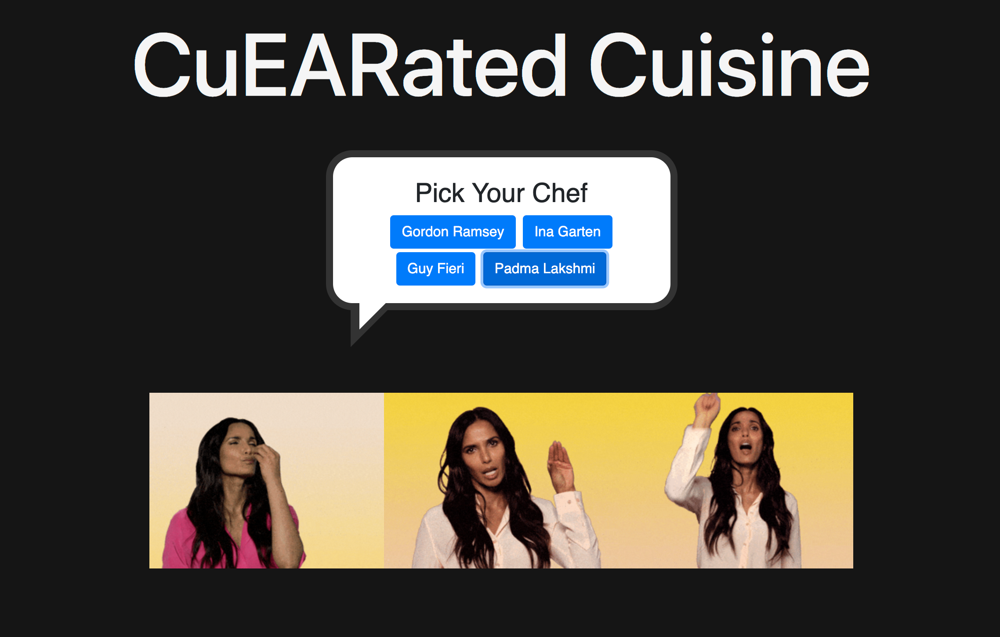
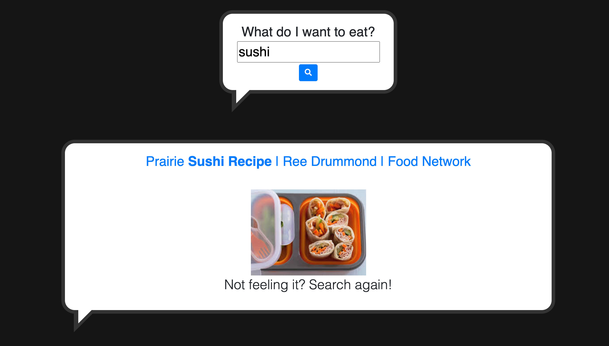
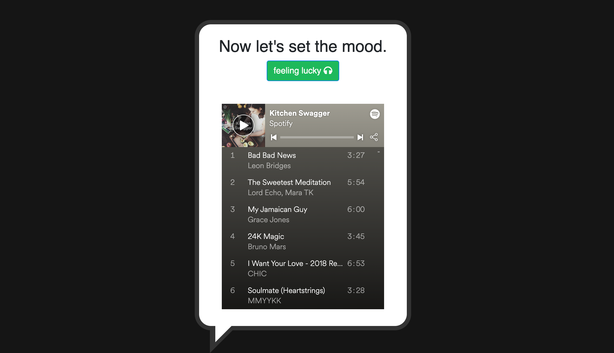

# CuEARated-Cuisine

https://docs.google.com/document/d/1VsAG-uksAfr5GX-3artgjjNF59ma4k5S-SWH6rONs1k/edit?ts=5efa1494

## Title: CuEARated Cuisine

## Project description: 

As “stay-at-home” restrictions continue due to the COVID-19 pandemic, the opportunity for people to cook at home is greater than ever before.

Our application allows users the opportunity to select a number of celebrity chefs provided and have gifs of those chefs appear, recreate the experience of dining at a restaurant by providing them with a variety of cuisines, and creating ambiance with curated music, all in the comfort of their own home.

## User story: 

AS A person who enjoys dining experiences, 
I WANT to enjoy a unique meal and corresponding music with my favorite chef 
SO THAT I can recreate the restaurant experience at home 

### Acceptance Criteria:
GIVEN I am preparing dinner 
WHEN I open the app 
THEN I am prompted to select a celebrity chef 
WHEN I select a chef 
THEN gifs of that chef appear 
WHEN I am prompted to make a selection based on food I want to cook 
THEN I am presented with a randomized recipe 
WHEN I click the recipe 
THEN a new tab with the recipe opens 
WHEN I do not like the recipe 
THEN I can choose another recipe by clicking the button again 
WHEN I click the feeling lucky button 
THEN a randomized Spotify cooking playlist appears 
WHEN I do not like the playlist 
THEN I can choose another playlist by clicking the button again

## Demo:

## APIs to be used:

### Giphy 
### Google Custom Search Engine

## Breakdown of tasks: 

### Front-end: 
Valeria 
### Back-end: 
Google Custom Search Engine API and Spotify JavaScript (Jacqueline) 
Giphy API (Janella)
